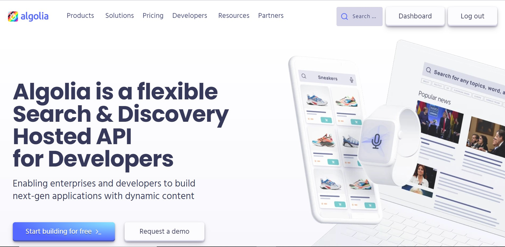

# Algolia-RealTime-DashBoard-Code

## What is Algolia?
Algolia is a hosted search engine, offering full-text, numerical, and faceted search, capable of delivering real-time results from the first keystroke. Algolia’s powerful API lets you quickly and seamlessly implement search within your websites and mobile applications. Our search API powers billions of queries for thousands of companies every month, delivering relevant results in under 100ms anywhere in the world.

## An end-to-end search solution
You can’t build high-end search without excellent user experience. This is why Algolia provides you with everything you need to build an as-you-type search experience with instant results. Users greatly benefit from seeing well formatted search results with images and highlighted text instantly on their screen, rather than having to submit their search and wait for results. This is “search at the speed of thought”. Visual immediacy is vital to the decision-making process.

 

While speed is key to user experience, many other aspects go into making Algolia a full-featured, comprehensive search solution: custom ranking, configuration, and adaptability, tailored UI components for the front end, personalization, analytics, A/B testing . Algolia provides everything you need to build excellent search.

#
To know more about Algolia refer to it's official [Website](https://www.algolia.com/) and [Documentation](https://www.algolia.com/doc/)
